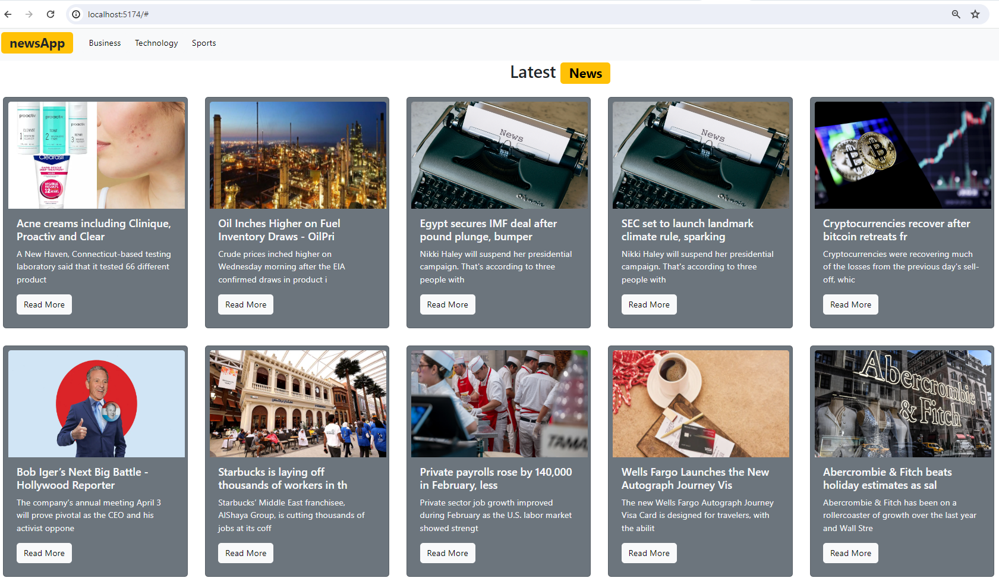

# News App

A simple React app that fetches and displays the latest news headlines using the News API. This React application allows users to explore the latest news headlines from various categories such as General, Business, Technology, and Sports. The news data is sourced from the News API.





# How It's Built

Here's a brief overview of the technologies and tools used:

## Technologies Used

1. **Vite:** Vite is a fast build tool for modern web development. It is used to scaffold the project, handle dependencies, and provide a smooth development experience.

2. **React:** React is a popular JavaScript library for building user interfaces. It simplifies the process of creating modular and reusable components, making the codebase more maintainable.

3. **Bootstrap:** Bootstrap is a front-end framework that provides a collection of pre-designed components and styles. It helps create a responsive and visually appealing user interface without extensive custom styling.

## Project Structure

The project structure is organized to maintain clarity and separation of concerns:

- **`src` Directory:** This directory contains the source code of the application.

  - **`Components` Directory:** Holds React components responsible for different parts of the app, such as the Navbar, NewsBoard, and NewsItem.
  - **`assets` Directory:** Contains images and other static assets used in the project.

- **`.env` File:** This file stores sensitive configuration details, such as the News API key, allowing the app to securely fetch news data.

## Scripts

The project utilizes npm scripts to streamline various tasks:

- **`npm run dev`:** Initiates the development server using Vite, allowing for real-time code changes and testing.

- **`npm run build`:** Generates a production-ready build of the application, optimizing and bundling the code for deployment.

- **`npm run lint`:** Utilizes ESLint to enforce coding standards and maintain code consistency.

- **`npm run preview`:** Launches a preview server to review the production build locally before deployment.

## Development Workflow

1. **Clone the Repository:**
   ```bash
   git clone https://github.com/your-username/news-app.git
   ```

## Usage

- Select news categories (General, Business, Technology, Sports).
- View the latest news headlines with images.
- Read more about each news article.

## Features

- **Category Selection:** Choose news categories to explore different topics.
- **Headline Display:** View the latest news headlines with accompanying images.
- **Article Details:** Read more about each news article by clicking on the "Read More" button.


## License

This project is open for exploration and learning. I created it for educational purposes. Feel free to check it out.

# React + Vite

This template provides a minimal setup to get React working in Vite with HMR and some ESLint rules.
